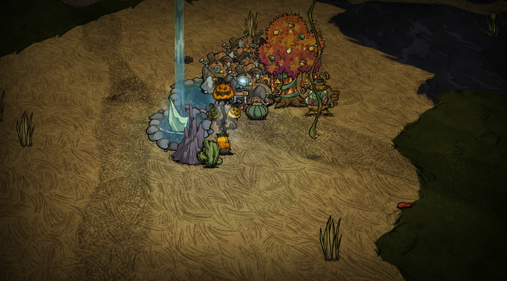
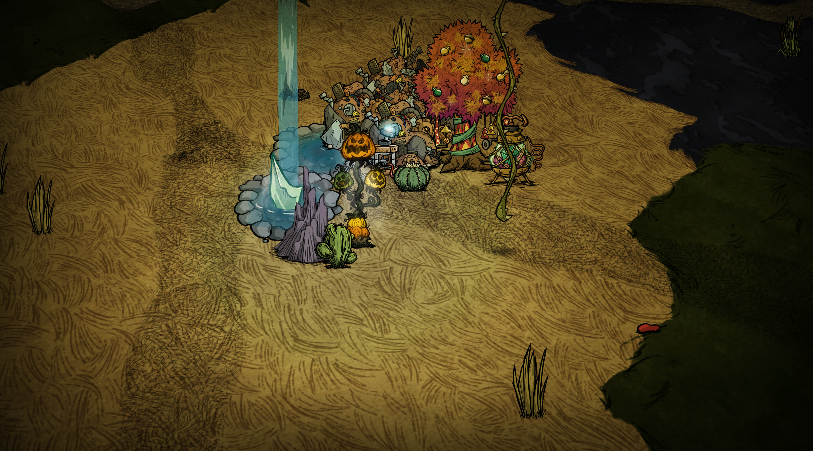

# BCAS Studio —— 饥荒画质增强 Mod

**饥荒史上第一个真正具备实质性画质提升、具备深度后处理管线的 Mod。**
这是旧版画面优化方案的全面跃进：不再局限于调颜色，而是真正提升画质——
科学补偿饥荒缺失的动态范围与色彩，显著拉宽动态范围、重建纹理质感、
锐化边缘细节，效果等同甚至超越外挂 ReShade，而它只是一个人人可装的
纯游戏内 Mod：一键开关、实时调参、自动保存。

| 原版 | BCAS Studio |
| --- | --- |
|  |  |

> 对比图为同一场景、同机位、同光照的原版与开启 BCAS Studio（作者特调预设）
> 的实机截图。发布前请将两张截图放到 `docs/images/` 下并按上述文件名命名。

---

## 它为什么"实质提升画质"

饥荒的美术是手工绘制的 2D 资源，渲染目标只有 8-bit 精度，且没有任何
后处理：没有动态范围管理、没有边缘重建、没有颗粒氛围。BCAS Studio 用
两段实时着色器管线（Klei 官方 Mod Shader 接口）在每一帧上做完整的
图像工程处理：

### 1. 调色引擎（Pass 1 · 电影级色彩科学）

- **曝光补偿（EV）与白平衡**：以 2^n 增益模型科学重建亮度基准，
  白平衡支持体素无级调色轮直接取色，映射为 RGB 增益（等效 CDL 斜率）；
- **CDL 一级/二级调色**（Color Decision List，ASC 决策清单标准）：
  斜率（Slope）/ 偏移（Offset）/ 幂（Power）三组九参全通道暴露，
  可复刻任何调色软件的色彩倾向；
- **高光去饱和**：按亮度权重把过曝区域拉回白色，防止高光死白；
- **ACES 胶片曲线**：行业标准电影色调映射，sRGB 软底 EOTF 线性化
  （带线性 Toe，8-bit 暗部前 16 级灰阶不坍塌）→ 曲线 → 再编码；
- **科学补偿动态范围**：上述组合把饥荒"平"得发灰的直出画面重新拉出
  高光-中间调-阴影的层次关系，这就是对比图里"变好看了"的全部来源——
  不是滤镜糊弄，是把缺失的动态范围找了回来。

### 2. 双边自适应锐化（Pass 2 · 本 Mod 的画质核心）

对图像资源进行精准重置与改进的自研锐化管线，每一步都有明确的信号处理依据：

- **YCoCg 色度亮度分离**：只在亮度通道做锐化，色度完全不动，
  杜绝彩边与颜色伪影；
- **MAD4 活动量估计**：以四邻域平均绝对差（Mean Absolute Deviation）
  实时判定每个像素处于边缘 / 平坦 / 噪声区，权重随之自适应；
- **双边滤波基底（Bilateral Base）**：范围核以亮度差计算高斯权重，
  σ 随活动量自适应放宽（GradAdapt）——平坦区自动加权平均压制噪声，
  边缘区收窄保形；空间 σ 与中心像素权重独立可调；
- **细节层压缩**：提取 中心像素-双边基底 的细节层后，按"孤立边 /
  均匀边"两个方向描述子分级压缩，细线与孤立噪点不过冲；
- **软限幅（Soft Limiter）**：有理式 tanh 拟合 `s·x/(|x|+s)`，
  锐化修正的天花板随局部活动量、亮度（中间调权重 4Y(1-Y)）与
  色度保护增益三重自适应——强锐化无白边；
- **AURA 抗过冲（Adaptive Unified Ringing Attenuation）**：
  以局部亮度包络（5 点 min/max）为界做软限制，亮部/暗部过冲余量
  独立配置（±0.003 / ±0.009），数学上不可能振铃；
- **暗部保护**：噪声基底阈值 + 线性坡道，近黑区域自动回退原始亮度，
  夜晚画面不炸噪；
- **色度保护与微饱和跟随**：色度主导的边缘降低锐化增益；
  锐化带来的亮度增益按 0.85~1.20 折算回色度饱和度，边缘"提神不脱色"；
- **8-bit 加固三件套**：2 LSB 噪声底限（量化台阶内的差异判定为垃圾，
  平坦地面绝不锐化成斑马纹）+ 双边核 (1 LSB)² 软偏置 + 双 pass 写回
  前的 ±0.5 LSB TPDF 亚像素抖动（对比度拉伸后的色带等高线彻底消失）；
- **性能工程**：4 邻域 SIMD `vec4` 向量化、有理式限幅替代 `exp()`、
  无 sin 快速哈希颗粒——单帧两次全屏 pass，零 Lua 每帧开销。

### 3. 氛围与原生增强

- **暗角**：压暗四角聚焦视线；
- **动态胶片颗粒**：8Hz 闪动的三角分布哈希颗粒（不是死噪点贴图）；
- **原版昼夜滤镜开关**：可关闭游戏自带的 ColourCube 昼夜调色，
  把色彩管理权完全交给本 Mod；
- **高清字体**：思源黑体全局替换（可在配置里关闭）。

---

## 上手

```
1. 订阅/下载后放入 mods 目录并启用
2. 进世界后：Home 打开「画质工作室」面板
3. 预设选「作者特调」即为发布默认画质（实机调校，截图即所得）
4. 五个页签 40+ 项参数全部实时生效：
   拖数值微调 · 点数值键入任意值 · 行尾 R 复位
5. PgDn 保存并关闭 · ESC 放弃更改 · P 开关滤镜
```

- 锐化页：锐化强度 / 降噪 / 抗振铃 / 暗部保护
- 进阶页：双边范围σ / 空间σ / 中心权重 / 噪声基底 / AURA 阈值与过冲 / 色度保护
- 色彩页：曝光 EV / 饱和度 / 自然饱和 / 对比 / 亮度 / Gamma / ACES /
  高光去饱和 / 原始混合 + **白平衡调色轮**（色相环无级取色 + RGB 增益）
- 调色页：CDL 一级 斜率/偏移/幂（RGB 九参）
- 氛围页：暗角 / 颗粒 / 原版昼夜滤镜开关

改乱了不用怕：行尾 R 单项复位，预设一键回正，ESC 放弃本次全部改动。

## 兼容性

- 纯客户端渲染效果，主机无需安装；
- 不依赖、不冲突 ReShade（二者取一即可，本 Mod 自带面板与保存）；
- 高清字体与其它字体 Mod 二选一。

---

## 作者

**楠眠已**

默认参数为实机逐项调校。日志诊断、调色科学、8-bit 图像工程细节等
开发笔记见 [docs/ARCHITECTURE.md](docs/ARCHITECTURE.md)、
[docs/CAPABILITIES.md](docs/CAPABILITIES.md) 与
[docs/OLD_FX_ANALYSIS.md](docs/OLD_FX_ANALYSIS.md)。
