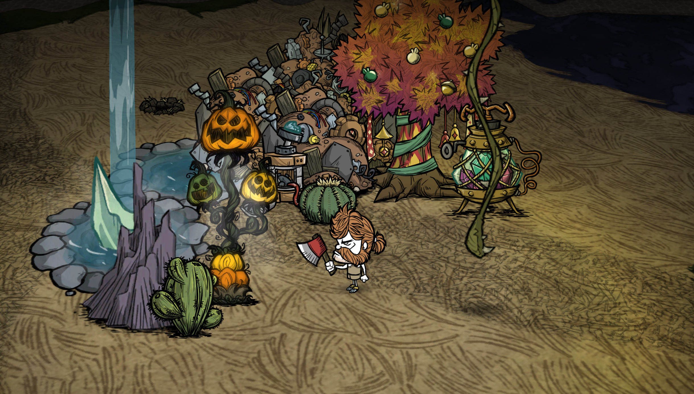
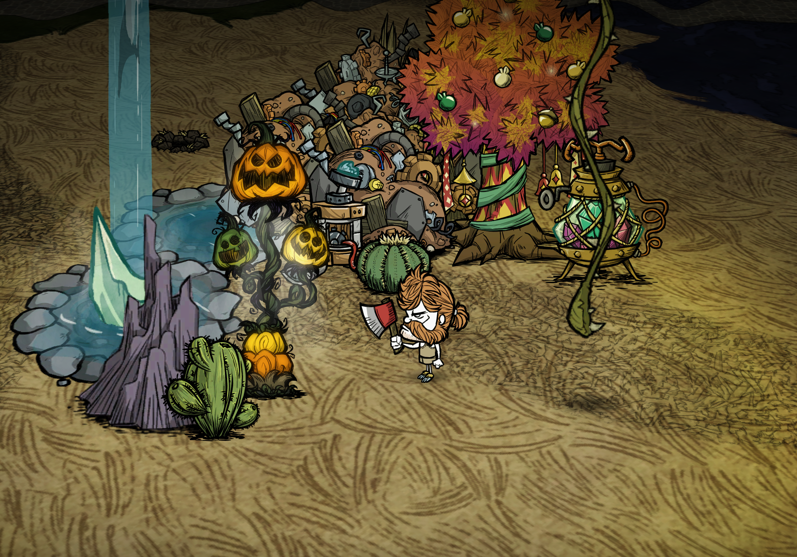

# BCAS Studio —— 饥荒联机版画质增强（V6）

**保留《饥荒》原本的手绘美学，然后把它调到最好。**

BCAS Studio 是《饥荒：联机版》打通全自定义后处理管线的画质增强 Mod。
通过官方 Mod 着色器接口接入双 pass 实时渲染管线，锐化、墨线修复、
电影调色、辉光、动态太阳光影全部在游戏内实时完成。
40+ 参数实时可调、自动保存，性能开销与原版后处理相当。

---

## 特性总览（V6）

| 模块 | 说明 |
| --- | --- |
| 反卷积墨线修复 | 在饥荒内引入反卷积算法，对图集流程造成的贴图模糊做在线重置 |
| 双边自适应锐化 | CAS 同级采样开销，离线级双边锐化质量 |
| 电影调色引擎 | 曝光 / 白平衡色轮 / CDL 一级二级 / ACES 胶片 / 高光去饱和 / 原画混合 |
| 辉光管线接管 | 原生 Bloom 置空，替换为 Kawase 四层金字塔柔光，开销相当 |
| 动态全局太阳光 | 日晷模型驱动的世界空间太阳，地面投影全天无级扫动 |
| 透云光束 | 云层开合的阳光穿透光斑，光源给遮挡物勾边 |
| 海洋地皮调色 | 绿洲系海洋配色，世界生成时烘焙进海洋纹理 |
| 原版滤镜接管 | 低 SAN 保色 / 失真消除 / 积雪上限 / 风沙过滤 |
| 高清字体 | 内置更纱黑体（SIL OFL） |
| 画质工作室 | 7 页签 40+ 参数、三套预设、白平衡光学色轮、自动保存 |

---

## 前后对比

**锐化与画质修复**（同场景、同机位、同光照，作者特调预设）：

| 原版 | BCAS Studio |
| --- | --- |
|  |  |
|  |  |

> 📸 更多模块的前后对比图将陆续补充（逆卷积墨线 / 辉光 / 动态太阳光影 / 水面）。

---

## 渲染管线与参数总线

```
游戏画面（引擎渲染完成，HUD 之前）
   │
   ├─ PASS 1  bcas_cinema.ksh   电影调色引擎
   │     BCAS_GRADE_A/B/EXTRA + BCAS_CDL_S/O/P + BCAS_SEC_S/O/P
   │
   ├─ PASS 2  bcas_studio.ksh   锐化与终合成
   │     BCAS_SHARPEN + BCAS_DECONV + BCAS_SHARP2 + BCAS_AURA + BCAS_ATMO
   │
   ├─ 辉光子管线（BloomOn 时接管，替代原生 Bloom）
   │     场景降采样 → kawase_pre（软膝预滤）→ kawase2 / 4 / 8（三层金字塔）
   │              → bcas_glow（核心+中环）→ bcas_glow2（宽环+长尾+暖偏移
   │                 +光包裹+轮廓光+透云光束+Reinhard 压缩+终合成）
   │
   └─ 实体级  bcas_sun_emitter.lua  动态太阳光影（世界空间）
```

全部可调参数打包为 vec4 uniform，`PackUniform` 按通道号写入，
改动瞬间下发一次，Lua 每帧零重算。

### uniform 总线映射（40+ 参数）

| Uniform | 通道 | 参数 |
| --- | --- | --- |
| `BCAS_SHARPEN` | x/y/z/w | 锐化强度 / 降噪 / 抗振铃 / 暗部保护 |
| `BCAS_DECONV` | x/y/z/w | 逆卷积强度 / 边缘门控 / 暗部穿透 / — |
| `BCAS_SHARP2` | x/y/z/w | 双边范围σ / 空间范围σ / 中心权重 / 噪声基底 |
| `BCAS_AURA` | x/y/z/w | AURA 边缘阈值 / 亮部过冲 / 暗部过冲 / 色度保护 |
| `BCAS_GRADE_A` | x/y/z/w | 曝光 EV / 色温 / 色调 / 饱和度 |
| `BCAS_GRADE_B` | x/y/z/w | 自然饱和 / 对比度 / 明度 / Gamma |
| `BCAS_EXTRA` | x/y/z/w | ACES 混合 / 太阳全局光 / 太阳屏幕 UV ×2 |
| `BCAS_CDL_S/O/P` | xyz+w | CDL 一级斜率·偏移·幂（w = 高光去饱和 / 二级开关） |
| `BCAS_SEC_S/O/P` | xyz+w | CDL 二级斜率·偏移·幂（w = 原画混合） |
| `BCAS_ATMO` | x/y/z/w | 暗角 / 颗粒 / 时间动画 / — |
| `BCAS_GLOW` | x/y/z/w | 辉光强度 / 阈值 / 软膝 / 暖度 |
| `BCAS_GLOW2` | x/y/z/w | 扩散 / 辉光饱和 / 高光压缩 / — |
| `BCAS_GLOW3` | x/y/z/w | 光晕长尾 / 光包裹 / 轮廓光 / 透云光束 |

引擎开关型参数（投影 / 海洋 / 色块 / 保色 / 积雪 / 风沙 / 官方调色强度）
由参数状态机直接驱动对应引擎接口，与渲染参数共用同一面板与持久化。

---

## 核心技术

### 一、反卷积墨线修复（DECONV）

在饥荒内引入反卷积算法，对图集合成流程造成的贴图模糊做在线重置。

经典反卷积依赖点扩散函数（PSF）估计：摄影场景的模糊来自镜头抖动、
失焦与运动，PSF 逐帧逐区域变化，运动物体需要单独搭建运动模型，
估计误差直接转化为振铃与鬼影。

饥荒贴图的模糊来源则是确定量：美术资源进入引擎前经过图集合成与
多级双线性缩放，高频细节被一个各向近均匀的低通核抹平。该核可
参数化为已知量，问题从 PSF 估计退化为固定核求解，在线反卷积成立。

实现（`bcas_studio.ksh` DECONV 通道）：

1. 边缘法向检测：亮差梯度主方向作为墨线法向，采样只沿法向进行，切向不取点；
2. 双边门控核：核权重受边缘门控（`DeconvGate`）约束，跨强边缘样本被抑制，墨线两侧互不渗透；
3. 暗部穿透补偿（`DeconvPenetr`）：勾线偏深一侧的损耗单独加权收敛；
4. 强度总控（`DeconvStrength`，0 ~ 2.0）；
5. 执行顺序：逆卷积在前恢复边缘斜率，双边锐化在后完成表面处理。

### 二、双边自适应锐化（BCAS_SHARPEN + SHARP2 + AURA）

以等同 CAS 的十字形 5 采样开销，实现双边锐化的处理质量。
`bcas_studio.ksh` 流水线：

1. YCoCg 色亮分离：锐化只作用于亮度 Y，色度经色度保护权重
   （`ChromaProtect`）跟随亮度活动量，不产生彩色镶边；
2. MAD4 活动量估计：十字 4 采样平均绝对差作为局部活动量，
   驱动 σ 自适应双边范围核（`RangeSigma`）：平坦区收窄核范围抑制噪声放大，
   纹理区放宽保证锐度；
3. 空间范围σ（`SpatialSigma`）与中心权重（`CenterWeight`）控制
   作用半径与力度分布；
4. 细节层压缩 + 噪声基底（`NoiseFloor`）：细节层先减噪声底限再压缩高幅段；
5. 软限幅：锐化输出限幅进原始值 ± 包络；
6. AURA 包络抗过冲（`AR_Threshold` / `AR_L_Overshoot` / `AR_D_Overshoot`）：
   亮部、暗部双通道过冲守卫，仅超过阈值的真实边缘允许有限过冲；
7. 暗部保护（`DarkProtect`）：低亮度区按曲线收敛锐化量；
8. 8-bit 加固：2LSB 噪声底限、TPDF 抖动抗色带、软底 EOTF；
9. 作用域：仅采样游戏世界（HUD 在引擎另一 pass 绘制，不经过本管线）；
   Lua 零每帧开销，全部计算在 GPU。

### 三、电影调色引擎（bcas_cinema.ksh）

算子顺序与工业调色流程一致：

```
曝光 EV → 白平衡增益（色温×色调）→ CDL 一级（斜率/偏移/幂）
→ 高光去饱和 → ACES 胶片曲线混合 → 饱和/自然饱和/对比/明度/Gamma
→ CDL 二级 → 原画混合 → 输出至 PASS 2
```

- 白平衡光学色轮：色相环 × 饱和度 × 明度取色，HSV 经
  `GainToTempTint` 解析式映射为色温/色调两轴，再合成 RGB 增益；
- CDL：ASC Colour Decision List 原语，斜率/偏移/幂三段一级校正
  + 独立二级校正器（带原画混合保护）；
- 官方调色强度：包装引擎 `SetColourCubeLerp`，按滑杆缩放官方
  季节/昼夜 LUT 混合，0 = 原色 ~ 1 = 原版；
- ACES 近似胶片曲线：sRGB 软底 EOTF 上做高光滚落混合。

### 四、辉光管线接管（kawase ×4 + bcas_glow / bcas_glow2）

开启辉光时钩住引擎 `SetBloomEnabled`，原生 Bloom 强制置空，
由本管线替代：

1. 场景降采样；
2. `kawase_pre` 软膝预滤：`GlowThreshold` / `GlowKnee` 双段门槛，
   仅光源（火堆、萤火虫、灯笼）进入辉光，地面亮斑不进入；
3. `kawase2 / 4 / 8`：递增步长的 Kawase 模糊金字塔，
   同等视觉半径下采样量约为双 pass 高斯的 1/3；
4. `bcas_glow`：核心层 + 中环层加权合成（`GlowIntensity` / `GlowSpread` / `GlowWarmth` / `GlowSat`）；
5. `bcas_glow2` 终合成：
   - 光晕长尾（`GlowTail`）：最外层按长尾权重抬升，辉光对数消散；
   - 光包裹（`LightWrap`）：暖光晕按暗部掩码沁入阴影，软化光源硬边；
   - 轮廓光（`GlowRim`）：光源邻近几何边缘勾 1-2px 暖亮边，远处不勾；
   - 透云光束（`GodRays`）：沿太阳方向的辉光层空气光柱；
   - Reinhard 高光压缩（`GlowCompress`）；
6. 呼吸微闪：Lua 8Hz 驱动多频正弦标量（0.92~1.08）仅调制光晕层，
   光源核心保持稳定。

### 五、动态全局太阳光与透云光束（bcas_sun_emitter.lua）

日晷投影模型（gnomon）：输入取自 `TheWorld.state`
（相位进度 / 满月 / 季节 / 降水），离散状态缓存键 + 相位切换毛刺修复，
单一解析式全局共享：

```
白天:   leg1   = 2·Lmax · (progress − 0.5)
        影长   = √(leg1² + Lmin²)
        旋角   = atan(leg1 / Lmin)
        透明度 = 0.55 · min(1, time/FADE)
黄昏:   影长/旋角固定，透明度随进度衰减
满月夜: 同白天扫动，投影染月光蓝 (0.10, 0.15, 0.30)
季节/天气: ×冬季 0.85 / ×夏季 1.10 / ×雨雪 0.80
```

- 剪影投影实体：角色与大型地物挂 `OnGround` 贴地剪影，
  与本体动画逐帧同步，皮肤/骑乘/换装跟随；
- 调度：移动实体逐帧，静态实体按距离分层帧预算（错峰种子）；
  位置同步与渲染参数分离；夜晚/洞穴零开销门控；
- 透云光束：3 个光斑实体按 gap→in→hold→out 状态机模拟云层开合，
  随机落在玩家周边，引擎光源给遮挡物勾边；
- 光色与强度随昼夜/季节/天气联动，不改变饥荒美术语言。

### 六、海洋地皮调色（bcas_ocean.lua）

8 种海洋地块的 primary / secondary / 昼夜变体 / 小地图配色 / wavetint
在世界生成时写入地皮定义表，由引擎烘焙进海洋纹理，经原版渲染路径
呈现。零额外渲染开销。温泉等水体由 `AttachWaterFX` 挂引擎光源点缀。
地皮配色烘在世界数据里，OCEAN 开关改动需重进世界生效。

### 七、原版滤镜接管与高清字体

- 低精神保色 / 失真消除 / 积雪上限（0~3）/ 风沙遮罩过滤：
  引擎函数可逆包装，实时生效；
- 高清字体：内置更纱黑体（Sarasa UI SC，SIL OFL），
  三重挂载点对抗引擎字体重置。

---

## 画质工作室（设置面板）

进世界后按 **Home** 打开。7 个页签、40+ 参数，拖动即实时预览：

| 页签 | 内容 |
| --- | --- |
| 01 锐化 | 锐化 / 逆卷积 / 降噪 / 抗振铃 |
| 02 进阶 | 双边核与 AURA 包络参数 |
| 03 色彩 | 曝光 / 饱和 / 对比 / ACES / 白平衡色轮入口 |
| 04 调色 | CDL 一级校正 |
| 05 氛围 | 暗角 / 颗粒 / 原版滤镜接管 |
| 06 辉光 | 强度 / 阈值 / 软膝 / 扩散 / 暖度 / 压缩 |
| 07 光影 | 地面投影 / 海洋 / 太阳全局光 / 透云光束 / 轮廓光 / 光包裹 |

三套一键预设（同一基底、不同强度）：

- **# 特调方案**：作者实机调校定版（2026-09 七页逐项基准）
- **# 轻量画质**：同基底收敛强度
- **# 电影胶片**：同基底加重调色与氛围

行尾 R 一键复位，PgDn 保存，ESC 快照回滚，所有改动自动持久化。

---

## 前后对比

**锐化与画质修复**（同场景、同机位、同光照，作者特调预设）：

| 原版 | BCAS Studio |
| --- | --- |
|  |  |
|  |  |

> 📸 更多模块的前后对比图将陆续补充（逆卷积墨线 / 辉光 / 动态太阳光影 / 水面）。

---

## 安装

- 手动：把 `BCAS-Studio/` 整个文件夹复制到 `.../Don't Starve Together/mods/`，
  游戏内启用该 Mod（客户端 Mod，进世界后按 Home）
- 或直接使用创意工坊版本

## 性能与兼容

- 纯客户端 Mod（`client_only_mod`），专用服务器零渲染开销
- 双 pass 后处理 + Kawase 辉光的总开销与原版 Bloom 相当
- 与地图类 / 角色类 Mod 无冲突；不修改任何游戏文件

## 从源码构建

着色器无需外部编译器：`tools/build_ksh.py` 把 GLSL ES 源码直接组装为
引擎可加载的 `.ksh` 容器（含 GLSL↔条目表交叉校验、~4096 字节安全线、
字节级 round-trip 自检）：

```bash
python tools/build_ksh.py        # 全部 GLSL 源码 → .ksh
python tools/make_modicon.py     # 模组图标 → KTEX(DXT5 全 mip 链)
```

容器格式、条目表与尾块语义见
[docs/ARCHITECTURE.md](docs/ARCHITECTURE.md)，
构建细节与故障排查见 [docs/BUILD_AND_INSTALL.md](docs/BUILD_AND_INSTALL.md)。

## 协议

- 代码：MIT License
- 内置字体：更纱黑体（SIL OFL 1.1），见 `BCAS-Studio/fonts/ATTRIBUTION.txt`
- 《饥荒：联机版》及相关美术素材版权归 Klei Entertainment 所有

---

作者：楠眠已 · NANMIANYI LAB
